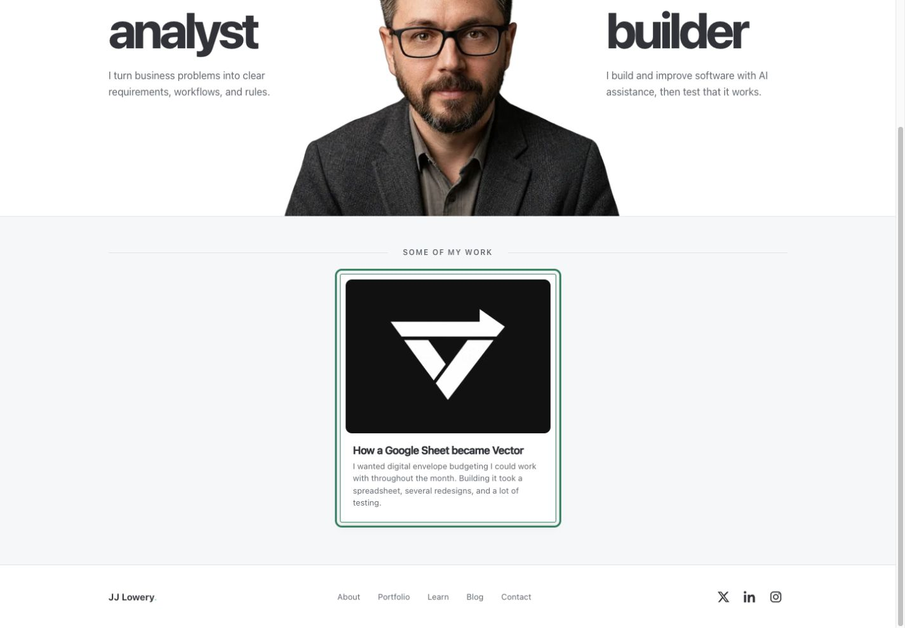
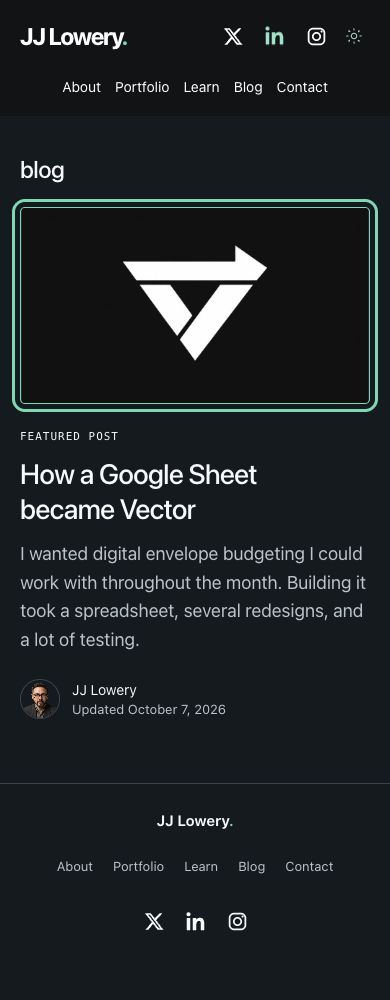

# Emerald navigation and tile interactions

The header/footer nav underline and framed work, Blog and personal-story tile borders use the existing Emerald palette on hover and keyboard focus. Header highlights use #64DAB1 against its permanent dark surface; footer/tiles use theme accent (#087F5B light, #64DAB1 dark). Nav also reveals the same underline while pressed. This does not introduce a persistent current-page underline.

The three source CSS files retain typography, spacing, imagery, card lift/shadow, neutral resting borders, buttons, article reading, print layout and CMS behavior. No content was published or email sent.

## Verification

`pnpm check` exited 0 using Node26/pnpm10.30.3 and the existing public CMS configuration, with both mail environment variables blank: lint zero warnings, TypeScript, 39/39 tests, production build and built HTTP/no-JavaScript checks passed. Real no-JavaScript form POST checks covered field errors, unavailable-provider notice, retained values and no false success with delivery disabled. `git diff --check` passed.

In the user's **Codex In-app Browser**, built Home and Blog were inspected at 320, 390, 768 and 1440 CSS pixels in both themes. Browser records show no horizontal overflow at every width. Work-card and Blog image keyboard focus were exercised separately from pointer hover; hover captures made by right-click/Escape can also have keyboard-visible focus. Header hover and header/footer keyboard focus were checked. Settled borders match #087F5B/#64DAB1; the visible focus outline is 3px. Early transition captures in the records may contain intermediate border colors/scales; settled states, not interpolation frames, were used for verification.

The following captures were actually reviewed for crop, wrapping, hierarchy and visible interaction state:

- Home light: card-focus 320, 390, 768, 1440 and card-hover1440.
- Home dark: card-focus320, 390, 768 and card-hover1440.
- Blog light: tile-focus320, 390, 768, 1440.
- Blog dark: tile-focus320, 390, 768, 1440.
- About light: nav-hover1440 and nav-focus390.
- About dark: nav-focus1440.

Filenames omit spaces (e.g. `home-light-card-hover-1440.jpg`). [Browser records](browser-records.json) contain all captures and measured states.

Changed boundary/focus colors use the same checked palette pairs as [the Emerald contrast measurements](../emerald-review/contrast.json): light accent on white 5.00:1, light accent on #F6F7F8 4.66:1, dark accent on #192228 9.38:1, dark accent on #202A31 8.49:1, and header accent on #111315 10.82:1. These measured pairs do not constitute a complete accessibility certification.

Existing reduced-motion CSS suppresses transitions for the nav pseudo-element/card and remains unchanged; the browser reported normal motion and reduced motion was not emulated. There is no new layout/type/motion or client code. Browser zoom at 200% was not repeated for this color-only change. Résumé print hides header/footer and its neutral print rules are unchanged; printing was not repeated. Personal-story strips are not mounted in currently published About content; their shared border rule was inspected in source, not presented as live coverage. Empty Portfolio/Learn placements remain empty.

Three Library reference PNGs could not transfer: all received HTTP403, including one bounded retry to a fresh Mac-local destination. Their pixels were unavailable, so verification used the actual live/built UI rather than assuming their appearance.

## Button recommendation — no implementation

Read the repository's [Practical UI color/control guidance](../../.agents/skills/portfolio-ui-design/references/practical-ui.md#color-and-controls). It is an original adaptation with source references to **Colour pp.79–90, 96–113, 116–151** and **Buttons pp.296–324**; primary/equal action hierarchy is pp.296–311. This review did not independently reopen the purchased book.

The current filled buttons are neutral at rest and already use Emerald on hover, with an Emerald keyboard focus outline. That is coherent and clearly readable. A touch user does not see desktop hover before choosing an action, so hover alone does not establish resting priority.

Recommendation: keep current buttons for now. If JJ wants one further adjustment, make **Send email** Emerald at rest as the contact page's primary completion action, with white text in light theme (5.00:1) and dark text in dark theme (10.20:1). Keep **Print / save as PDF** and the **theme toggle** neutral at rest. Preserve the article template's neutral reading style and decide optional article CTAs by the article's task; do not globally recolor every CTA. **Explore selected work** is a clear recovery action on 404 and can retain its current treatment. Equally valid actions need equal emphasis rather than a brand-color rule for all buttons.

Any primary-button change should retain distinct hover, focus, pressed and disabled/pending states, labels and current form recovery. Button styling was explicitly left unchanged in this PR.

